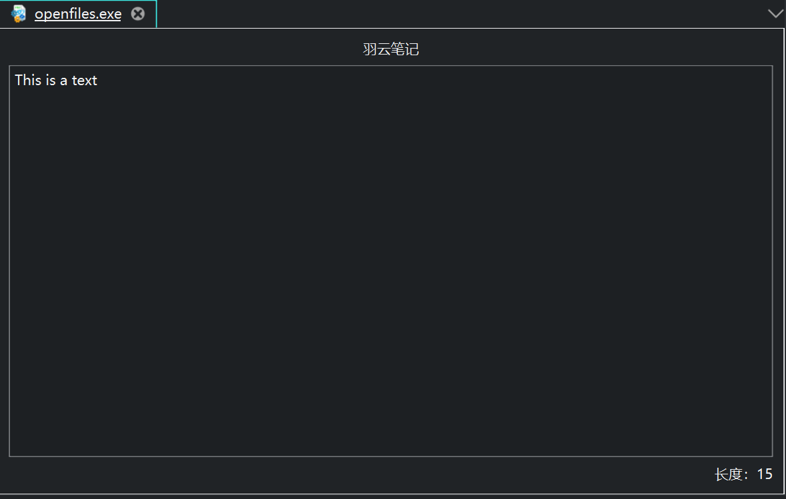

<h1 align="center">WingHexExplorer2.WingHexNote</h1>

WingHexNote

- 开源不易，给个 Star 或者 [捐助](#捐助) 吧

## WingHexNote

&emsp;&emsp;`WingHexNote`是一个羽云十六进制编辑器仅提供视图功能的插件，它可以在分析二进制的时候做一些记录，会跟随工作区的内容保存。**该插件仅在工作区启用的时候才能够使用。该插件在 WingHexExplorer2 的 v2.3.2 版本可用。**

### 协议

&emsp;&emsp;本插件仓库将采用`AGPL-3.0`协议，不得将该插件代码用于协议之外的用途。

## 效果图

WingHexNote

## 捐助

> If you are not Chinese, you can use [Afadian](https://afdian.com/a/wingsummer) to support me.

**
您的每一份支持都将是本项目推进的强大动力，十分感谢您的支持
**

感谢支持

